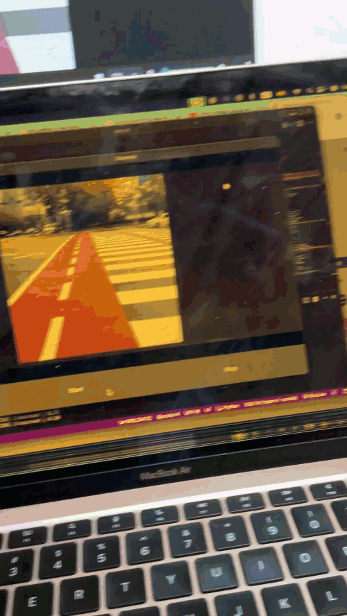

📱 Smart Vision App
AI-Powered Real-Time Object Recognition for Blind & Visually Impaired Users

Smart Vision App is a mobile application built with Kivy, TensorFlow Lite, and YOLO that performs real-time object detection from the device camera and speaks the detected objects aloud using offline TTS.
Designed to help visually-impaired users navigate safely.

🚀 Features
👁️ Real-Time Object Detection

YOLOv8-style TensorFlow Lite model

Detects people, vehicles, obstacles, traffic signs, etc.

Optimized for CPU (Android/iOS compatible)

🔊 Text-to-Speech Alerts

Uses Plyer TTS to verbally announce detected objects

Smart cooldown prevents repeated spam announcements

🎥 Live Camera Preview

Built using Kivy’s high-performance texture pipeline

Runs at 20–30 FPS on mid-range devices

📱 Mobile-First & Offline

Runs entirely on-device

No internet required

Privacy-safe

📦 Project Structure
SmartVision/
│
├─ main.py                # Kivy application
├─ util.py                # YOLO preprocessing + postprocessing
├─ names.py               # Class label names
├─ requirements.txt       # Desktop requirements
├─ requirements_android.txt
├─ assets/
│   ├─ best_float32.tflite
│   ├─ demo.gif
│   └─ icons/
└─ README.md

🧠 Model Information

Format: TensorFlow Lite (.tflite)

Input size: 640×640

Output shape: (1, 30, 8400)

Trained on custom dataset with 26 object categories (bikes, cars, pedestrians, fences, trees, cones, lights, etc.)

🛠 Installation (Desktop)

You need Python 3.10:

pip install -r requirements.txt
python main.py

📱 Build for Android (Buildozer)

Install Buildozer:

pip install buildozer
buildozer init

Edit buildozer.spec:

requirements = python3,kivy,plyer,numpy,opencv-python-headless,tensorflow-lite
android.permissions = CAMERA, RECORD_AUDIO

Then build:

buildozer -v android debug

APK will appear in the bin/ folder.

🍎 Build for iOS (Kivy-iOS)

Install Kivy-iOS:

pip install kivy-ios
toolchain build python3 kivy plyer
toolchain build tensorflow-lite
toolchain create smartvision main.py
toolchain xcode smartvision

🧩 Code Example
Running inference in the app:
input_data = preprocess(frame)[0]
interpreter.set_tensor(input_index, input_data)
interpreter.invoke()

raw_output = interpreter.get_tensor(output_index)
detections = parse_yolo_output(raw_output)
detections = nms(detections)

🎯 Future Improvements

Add vibration feedback for critical objects

Add navigation mode (crosswalk detection)

Add voice commands

Add Apple VoiceOver & Android TalkBack integration

Improve UI design

🤝 Contributing

Pull requests, model improvements, and new features are welcome!

📜 License

This project is licensed under the MIT License — free for personal and commercial use.

⭐ Showcase Your Work!

If this project helped inspire your own, please ⭐ the repo!
